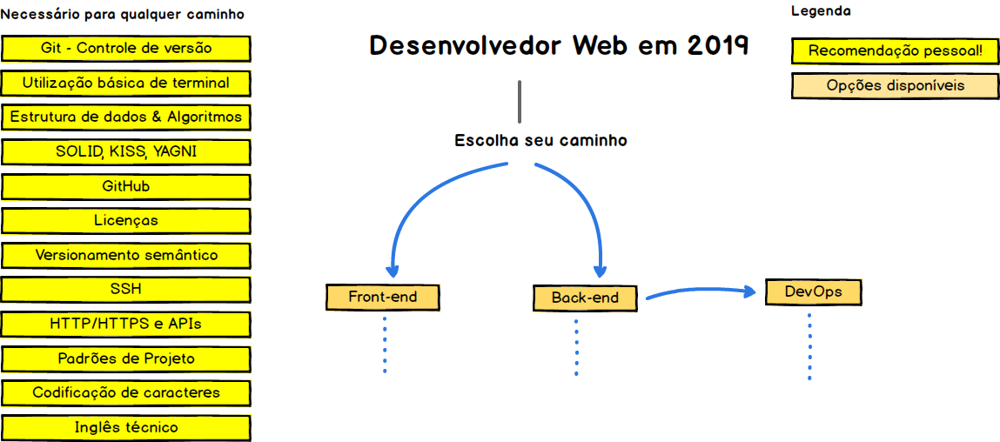
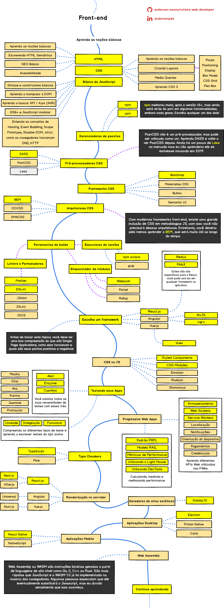
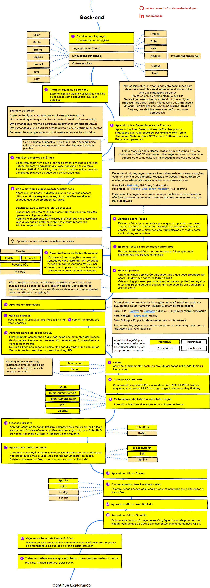

  
  <h2 align="center">Roteiro do Desenvolvedor Web</h2>
  
Roteiro para se tornar um Desenvolvedor Web em 2019

  

    
      
  

   

Abaixo você encontrará uma série de gráficos que demonstram os caminhos que você pode tomar e quais as tecnologias você deveria adotar para se tonar um desenvolvedor frontend, backend ou devops. Estes gráficos foram desenvolvidos originalmente por Kamran Ahmed, eu apenas fiz a tradução para Português(pt-br) com o intuito de auxiliar aqueles que não dominam a leitura da língua inglesa. 

Vejam o blog oficial do autor [blog](http://kamranahmed.info) e seu [Twitter](https://twitter.com/kamranahmedse).

## Aviso!
> O propósito deste roteiro é te dar um panorama geral e guia-lo se estiver confuso sobre o que aprender em seguida, e não para encoraja-lo a escolher apenas o que está na moda. Você deve compreender o motivo de uma ferramenta ser mais adequada do que outras para alguns casos, e sempre se lembrar de que o que está na moda nem sempre é o mais adequado para o trabalho.

## Introdução

## Roteiro Frontend

## Roteiro Back-end

## Roteiro DevOps

## 🚦 Fique ligado!

Se você acredita que este roteiro pode ser melhorado, por favor abra um Pull Request com as atualizações e também abra um Issues.

## Licença

